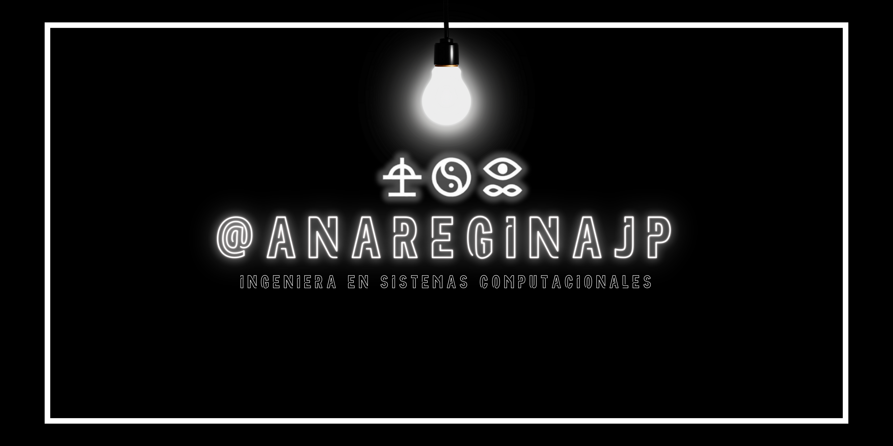

  

<!-- Fondo negro simulado usando tabla con una celda negra -->

  

  <table width="80%" style="background-color:#181818; border-radius:20px;">
    <tr>
      <td>
        <h1 align="center" style="color:#fff;">🌟 Hola Mundito :3</h1>
        

          <b style="color:#fff;">💙 Sobre mí</b> 
          <b style="color:#fff;">Lenguajes que uso:</b> 
          💙 Dart &nbsp; 💙 Flutter &nbsp; 💙 Java &nbsp; 💙 PHP &nbsp; 💙 React
            
          <b style="color:#fff;">Especialidad:</b> 
          💙 Ciencia de Datos
        

      </td>
    </tr>
  </table>

<!-- Línea negra divisoria -->

  

  <table width="80%" style="background-color:#181818; border-radius:20px;">
    <tr>
      <td>
        <h2 align="center" style="color:#fff;">💙 Certificaciones</h2>
        

          🔗 <b style="color:#fff;">LinkedIn:</b> 
          <a style="color:#19fff7;" href="https://www.scrumstudy.com/certification/verify?type=SFC&number=1110189">Scrumstudy SFC</a> 
          <a style="color:#19fff7;" href="https://www.credly.com/badges/2ce20433-23a7-4e3e-87f8-a1e0da41f930/linked_in_profile">Credly Badge</a>
        

      </td>
    </tr>
  </table>

  

  <table width="80%" style="background-color:#181818; border-radius:20px;">
    <tr>
      <td>
        <h2 align="center" style="color:#fff;">💙 Mi Discord</h2>
        

          🎧 <b style="color:#fff;">Usuario:</b> <code style="background:#000;color:#44ddff;">@kodokunigamixx</code>
        

      </td>
    </tr>
  </table>

  

  <table width="80%" style="background-color:#181818; border-radius:20px;">
    <tr>
      <td>
        <h2 align="center" style="color:#fff;">💙 Gatitos por todos lados</h2>
        

          
        

      </td>
    </tr>
  </table>

